# Izanagi (Madara Perpetual Simulation)

Izanagi is an external high-traffic simulation harness for Madara devnet + Starknet Perpetual contracts.

Fun fact: in Naruto, **Izanagi** is a forbidden jutsu that rewrites reality to match the desired outcome. Madara mastered it. The name fits this harness because it stress-tests node behavior under realistic simulated traffic.

## V2 goals

- Use **Madara binary artifacts** from upstream CI (no Madara build in this repo’s CI).
- Run a **balanced soak profile** with burst writes, windowed reconciliation, read storms, and trace checks.
- Validate standard Starknet RPC calls against official OpenRPC schemas.
- Enforce hard latency/error gates (`p50/p90/p99`) with baseline regression checks.
- Run **VM on PRs** and **VM + Native on nightly schedule**.

## Architecture

```mermaid
flowchart LR
A["GitHub Actions (PR/manual/nightly)"] --> B["Resolve backend/profile matrix"]
B --> C["Download Madara artifact binary"]
C --> D["Start Madara devnet (VM or Native)"]
D --> E["Checkout + build Starknet Perpetual @ pinned SHA"]
E --> F["Run scenario engine (strict + burst)"]
F --> G["Reconcile receipts in windows"]
G --> H["Spec conformance + RPC cross-endpoint checks"]
H --> I["Perf aggregation + SLO gates"]
I --> J["Write JSON/MD reports + post Slack summary"]
```



## Scenario suite (V2)

- `deploy_integrity_strict`
- `correctness_exact_values`
- `edge_hot_account_mixed`
- `write_burst_no_wait`
- `rpc_cross_endpoint_consistency`
- `read_storm`
- `trace_conformance`

## Required GitHub settings

### Repository variables

- `PERPETUAL_PINNED_SHA` (required)
- `MADARA_MAIN_BRANCH` (optional, default `main`)

### Repository secrets

- `SLACK_WEBHOOK_URL`

## Local run

```bash
npm install
npm run build
PERPETUAL_PINNED_SHA=<sha> SIM_BACKEND=vm npm run simulate
```

Optional overrides:

```bash
MADARA_REF=main \
MADARA_BINARY_PATH=/absolute/path/to/madara \
SIM_BACKEND=native \
SIM_PROFILE=balanced_soak \
SIM_DURATION_OVERRIDE_MS=1800000 \
SIM_BASELINE_PATH=/absolute/path/to/baseline.json \
STARKNET_SPEC_TAG=v0.10.0 \
STARKNET_SPEC_CACHE_DIR=.cache/specs/starknet \
RPC_URL=http://127.0.0.1:9944/rpc/v0_10_0 \
SIM_TIMEOUT_MS=1200000 \
PERPETUAL_SHA=<sha> \
npm run simulate
```
