# Madara Perpetual Simulation (V1)

External simulation harness for validating Madara devnet with Starknet Perpetual contracts.

## V1 goals

- Run against **latest Madara main**.
- Run against a **pinned Starknet Perpetual SHA**.
- Execute L2-only simulation scenarios (L1 deferred to V2).
- Trigger on manual dispatch and daily schedule.
- Publish run summaries to Slack webhook.

## Architecture

```mermaid
flowchart LR
A["GitHub Actions (manual/daily)"] --> B["Checkout simulation repo"]
B --> C["Checkout Madara @ latest main commit"]
C --> D["Build Madara binary"]
D --> E["Start Madara devnet"]
E --> F["Checkout Perpetual @ pinned SHA"]
F --> G["Build Perpetual artifacts"]
G --> H["Run TS simulation runner"]
H --> I["Write JSON/MD report artifacts"]
I --> J["Post Slack summary webhook"]
```



## Required GitHub settings

### Repository variables

- `PERPETUAL_PINNED_SHA` (required)
- `MADARA_MAIN_BRANCH` (optional, default `main`)

### Repository secrets

- `SLACK_WEBHOOK_URL` (required for Slack posting)

## Local run

```bash
npm install
npm run build
PERPETUAL_PINNED_SHA=<sha> npm run simulate
```

Optional overrides:

```bash
MADARA_REF=main \
MADARA_REPO=https://github.com/madara-alliance/madara.git \
PERPETUAL_REPO=https://github.com/starkware-libs/starknet-perpetual.git \
RPC_URL=http://127.0.0.1:9944/rpc/v0_10_0 \
SIM_TIMEOUT_MS=1200000 \
npm run simulate
```

## Current V1 status

- Infrastructure checks are strict (clone/build/start/report).
- Perpetual deploy and runtime flows are implemented as best-effort with detailed check reporting.
- Trace/fee exact-value baselines are intentionally placeholder/range-based.

